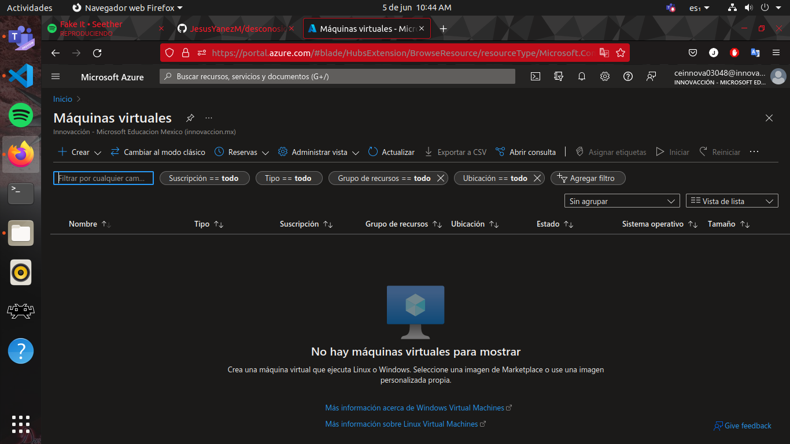
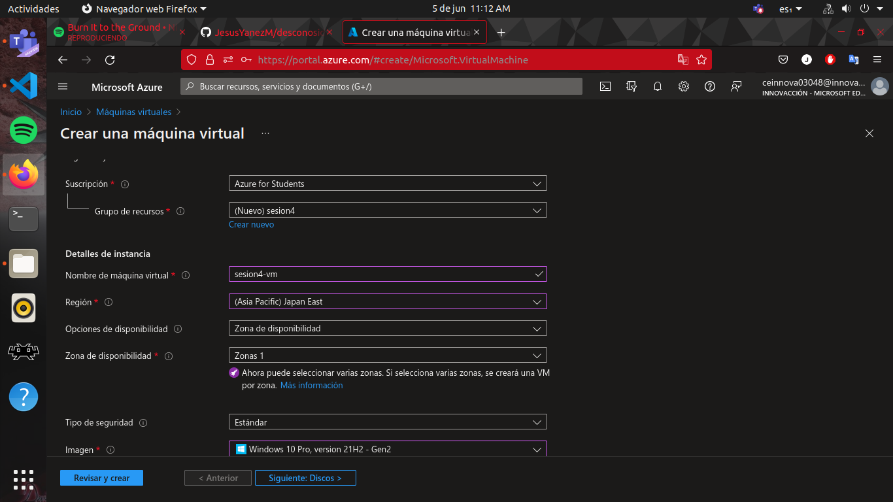
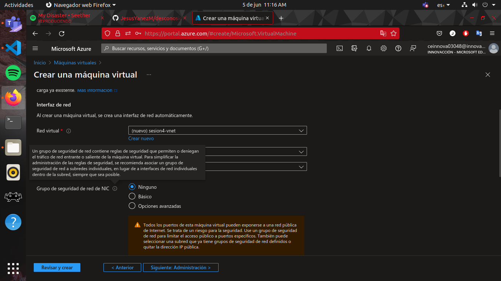
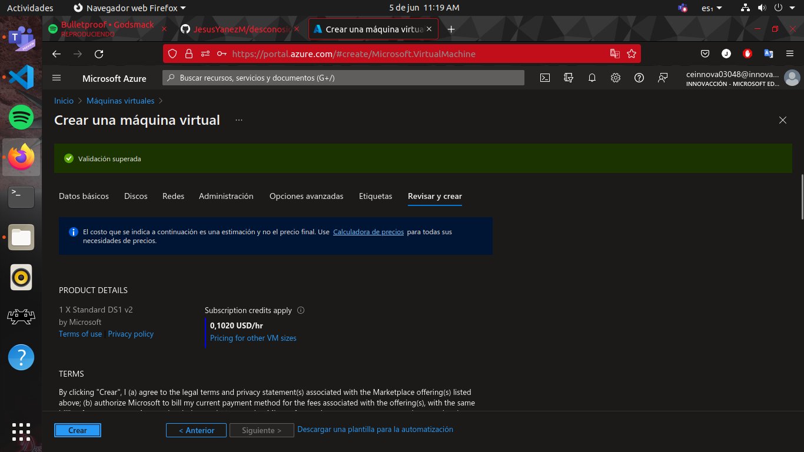
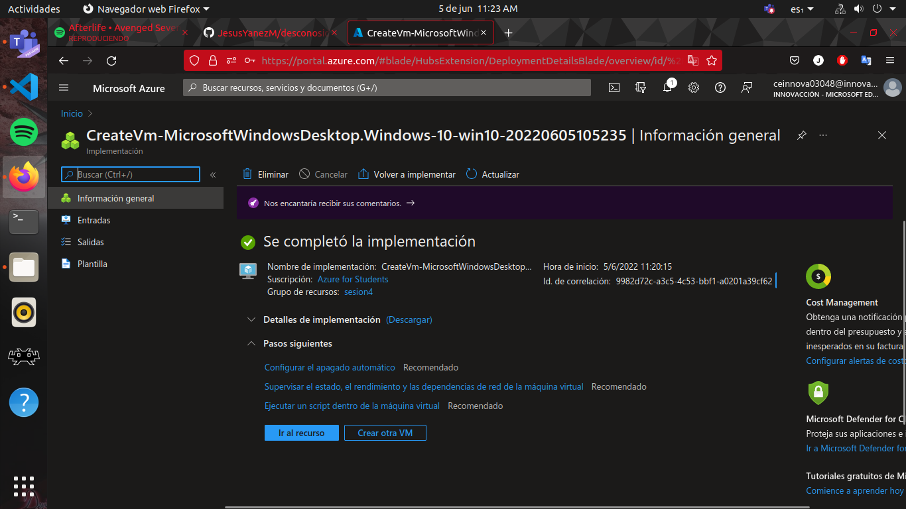
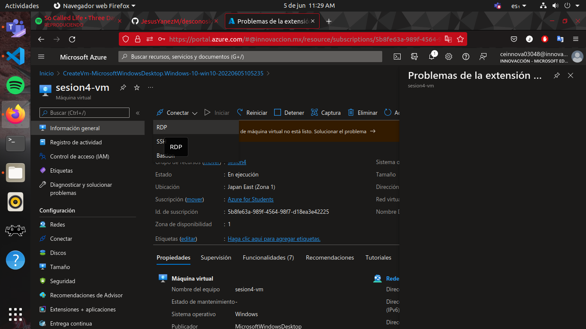

# Practica 2 Creacion de una maquina virtual

**Requisitos**

- Tener acceso a una suscripcion y cuenta de Azure

**Procedimiento**

- Lo primero es acceder al portal de azure y buscar ya sea por medio de la barra de busqueda o por los iconos de la pestaña de inicio, la obcion de Virtual Machine o maquina virtual

- Vamos a crear una nueva maquina virtual, la mas sencilla que resulta ser la primera opcion

- Durante la creacion solo llenaremos los parametros que esten vacios, ademas de crear un usuario y contraseña para la maquina virtual

- En el caso de esta practica escogeremos servidores de Asia ya que en los de america y estados unidos no hay tamaños economicos disponibles. En el apartado de redes solo cambiaremos la seguridad de Basico a Ninguno

- Ya solo presionamos revisar y crear, esperamos laa validacion y creamos el recurso

- Accedemos al recurso y en los botones superiores presionamos conectar por RDP, para que nos envie a la pestaña donde se descarga el ejecutable

- En nuestra maqina deberemos descargar el remote desktop, y simplemente ejecutamos lo que se descargo de la maquina virtual
