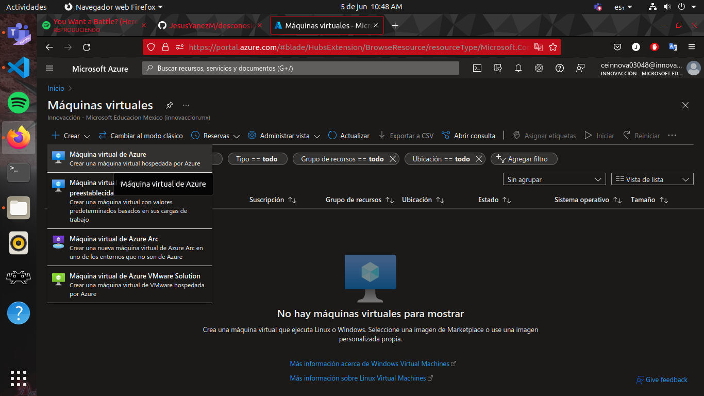
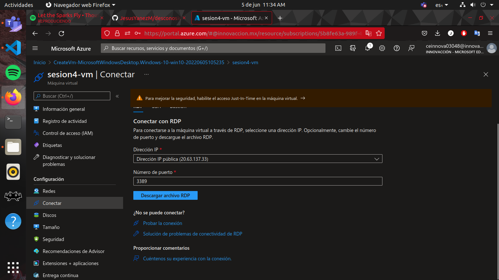
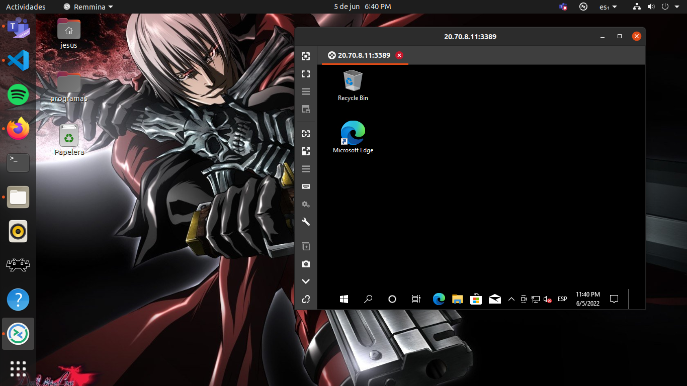

# Practica 2 Creacion de una maquina virtual

**Requisitos**

- Tener acceso a una suscripcion y cuenta de Azure

**Procedimiento**

- Lo primero es acceder al portal de azure y buscar ya sea por medio de la barra de busqueda o por los iconos de la pestaña de inicio, la obcion de Virtual Machine o maquina virtual

- Vamos a crear una nueva maquina virtual, la mas sencilla que resulta ser la primera opcion

- Durante la creacion solo llenaremos los parametros que esten vacios, ademas de crear un usuario y contraseña para la maquina virtual

- En el caso de esta practica escogeremos servidores de Asia ya que en los de america y estados unidos no hay tamaños economicos disponibles.

- Ya solo presionamos revisar y crear, esperamos laa validacion y creamos el recurso

- Accedemos al recurso y en los botones superiores presionamos conectar por RDP, para que nos envie a la pestaña donde se descarga el ejecutable

- En nuestra maqina deberemos descargar el remote desktop, y simplemente ejecutamos lo que se descargo de la maquina virtual

 - Lo siguiente que haremos sera crear una segunda maquina virtual con las mismas configuraciones

 - Ahora si podremos ejecutar lo que descargamos y podremos entrar a la maquina virtual

 

 - Lo siguiente que haremos sera conectar en red las dos maquinas virtuales que acabamos de crear

 - Bien ya hemos aprendido como crear dos maquinas virtuales y manipularlas por remote desktop
 

